# 桌面端消费记账应用 - 系统设计文档

**版本**：v1.1  
**创建日期**：2026-05-12  
**更新日期**：2026-05-14  
**文档状态**：已更新

---

## 1. 技术架构

### 1.1 技术栈选型

| 层级         | 技术选型                  | 说明                                  |
|-------------|--------------------------|---------------------------------------|
| 桌面框架     | Electron                 | 跨平台桌面应用框架                      |
| 移动端       | Capacitor                | Android WebView 包装                   |
| 前端框架     | React 18 + TypeScript    | 类型安全的组件化开发                    |
| UI 组件库    | Ant Design 5             | 企业级 UI 组件库，内置响应式支持         |
| 状态管理     | Redux Toolkit            | 集中式状态管理                          |
| 本地数据库   | SQLite + better-sqlite3  | 轻量级本地数据库（Electron 生产模式）     |
| 开发数据层   | localStorage + Mock API  | Web/移动端开发模式数据持久化             |
| 测试框架     | Vitest + jsdom           | 单元测试（14 个用例）                   |
| OCR 引擎     | PaddleOCR（规划中）      | 开源本地 OCR                           |
| 云端 OCR     | 阿里云/腾讯云 OCR（规划中）| 云端 OCR API                          |
| 云端同步     | 飞书多维表格 API（规划中）| 数据云端存储与同步                      |

### 1.2 系统架构图

```
┌─────────────────────────────────────────────────────────────┐
│                    Electron 渲染进程                        │
│  ┌──────────────┐  ┌──────────────┐  ┌──────────────┐      │
│  │  React UI    │  │  Redux Store │  │  Services    │      │
│  │  组件层      │  │  状态管理    │  │  API 调用    │      │
│  └──────────────┘  └──────────────┘  └──────────────┘      │
└─────────────────────────────────────────────────────────────┘
                          │ IPC 通信
┌─────────────────────────────────────────────────────────────┐
│                    Electron 主进程                          │
│  ┌──────────┐  ┌──────────┐  ┌──────────┐  ┌──────────┐  │
│  │ Database │  │   OCR    │  │  Feishu  │  │  Backup  │  │
│  │  Module  │  │  Module  │  │  Module  │  │  Module  │  │
│  └──────────┘  └──────────┘  └──────────┘  └──────────┘  │
└─────────────────────────────────────────────────────────────┘
         │              │              │
         ▼              ▼              ▼
    ┌─────────┐   ┌─────────┐   ┌─────────┐
    │ SQLite  │   │ 云端   │   │ 飞书 API │
    │ 数据库  │   │ OCR    │   │ 多维表格 │
    └─────────┘   └─────────┘   └─────────┘
```

---

### 1.3 移动端适配架构（Capacitor + Android）

```
┌─────────────────────────────────────────────────────────────┐
│                    Android 原生层                            │
│  ┌──────────────┐  ┌──────────────┐  ┌──────────────┐      │
│  │  MainActivity│  │  WebView     │  │  Capacitor   │      │
│  │  启动页      │  │  浏览器引擎  │  │  桥接层      │      │
│  └──────────────┘  └──────────────┘  └──────────────┘      │
└─────────────────────────────────────────────────────────────┘
                          │
┌─────────────────────────────────────────────────────────────┐
│                    React SPA（WebView 内运行）               │
│  ┌──────────────┐  ┌──────────────┐  ┌──────────────┐      │
│  │  React UI    │  │  Redux Store │  │  Mock API    │      │
│  │  (Ant Design)│  │              │  │ (localStorage)│     │
│  └──────────────┘  └──────────────┘  └──────────────┘      │
└─────────────────────────────────────────────────────────────┘
```

移动端直接复用 Web 端的 React 代码，通过 Capacitor 将 SPA 嵌入 Android WebView。数据层使用 localStorage Mock API。

---

## 2. 项目目录结构

```
expense-tracker/
├── src/
│   ├── main/                      # Electron 主进程
│   │   ├── main.ts                # 主入口
│   │   ├── preload.ts             # 预加载脚本
│   │   ├── ipc/                   # IPC 通信处理
│   │   │   └── index.ts           # 全部 handler 注册
│   │   ├── database/              # SQLite 数据库操作
│   │   │   ├── index.ts           # 数据库初始化 + 全部 CRUD
│   │   │   └── schema.ts          # 类型定义
│   │   └── types/                 # 类型声明
│   ├── renderer/                  # React 渲染进程
│   │   ├── main.tsx               # React 入口
│   │   ├── App.tsx                # 主组件（路由/布局/代码分割）
│   │   ├── index.html             # HTML 模板
│   │   ├── index.css              # 全局样式
│   │   ├── pages/                 # 页面组件（9 个）
│   │   │   ├── Login.tsx          # 登录/注册（品牌展示+核心特色）
│   │   │   ├── Dashboard.tsx      # 首页仪表盘
│   │   │   ├── Records.tsx        # 记账记录
│   │   │   ├── Accounts.tsx       # 账户管理
│   │   │   ├── Categories.tsx     # 分类管理
│   │   │   ├── Budgets.tsx        # 预算管理
│   │   │   ├── Settings.tsx       # 个人设置
│   │   │   ├── LedgerManage.tsx   # 账本管理
│   │   │   └── Logs.tsx           # 操作日志
│   │   ├── store/                 # Redux 状态管理
│   │   │   ├── index.ts           # Store 配置
│   │   │   └── slices/            # 7 个 Slice
│   │   ├── api/
│   │   │   └── mock.ts            # Mock API（localStorage 数据层）
│   │   ├── utils/
│   │   │   └── constants.ts       # 公共常量
│   │   └── assets/                # 静态资源
│   └── __tests__/                 # 单元测试
│       └── mock-api.test.ts       # Mock API 测试（14 用例）
├── android/                       # Capacitor Android 项目
│   └── app/src/main/              # Android 原生配置
├── docs/                          # 文档
│   ├── specs/                     # 需求说明书
│   └── design/                    # 设计文档
├── package.json
├── tsconfig.json
├── vite.config.ts
├── vitest.config.ts
├── electron-builder.yml           # Electron 打包配置
├── capacitor.config.ts            # Capacitor 移动端配置
└── .gitignore
```

---

## 3. 数据库设计

### 3.1 数据表结构

#### 记录表 (records)
| 字段名         | 类型        | 说明                |
|---------------|------------|---------------------|
| id            | INTEGER    | 主键，自增           |
| amount        | DECIMAL    | 金额                |
| type          | TEXT       | 类型：income/expense|
| category_id   | INTEGER    | 分类 ID，外键        |
| account_id    | INTEGER    | 账户 ID，外键        |
| date          | TEXT       | 日期                |
| note          | TEXT       | 备注                |
| tags          | TEXT       | 标签（JSON 数组）    |
| attachment    | TEXT       | 附件路径            |
| created_at    | TEXT       | 创建时间            |
| updated_at    | TEXT       | 更新时间            |
| synced_at     | TEXT       | 同步时间            |
| is_deleted    | INTEGER    | 是否已删除（0/1）    |

#### 账户表 (accounts)
| 字段名         | 类型        | 说明                |
|---------------|------------|---------------------|
| id            | INTEGER    | 主键，自增           |
| name          | TEXT       | 账户名称            |
| type          | TEXT       | 账户类型            |
| balance       | DECIMAL    | 余额                |
| color         | TEXT       | 颜色标识            |
| icon          | TEXT       | 图标                |
| created_at    | TEXT       | 创建时间            |
| updated_at    | TEXT       | 更新时间            |
| is_deleted    | INTEGER    | 是否已删除（0/1）    |

#### 分类表 (categories)
| 字段名         | 类型        | 说明                |
|---------------|------------|---------------------|
| id            | INTEGER    | 主键，自增           |
| name          | TEXT       | 分类名称            |
| type          | TEXT       | 类型：income/expense|
| icon          | TEXT       | 图标                |
| color         | TEXT       | 颜色                |
| is_default    | INTEGER    | 是否默认分类（0/1） |
| sort_order    | INTEGER    | 排序                |
| is_deleted    | INTEGER    | 是否已删除（0/1）    |

#### 预算表 (budgets)
| 字段名         | 类型        | 说明                |
|---------------|------------|---------------------|
| id            | INTEGER    | 主键，自增           |
| category_id   | INTEGER    | 分类 ID，外键        |
| amount        | DECIMAL    | 预算金额            |
| period        | TEXT       | 周期：monthly/quarterly/yearly |
| year          | INTEGER    | 年份                |
| month         | INTEGER    | 月份                |
| quarter       | INTEGER    | 季度                |
| created_at    | TEXT       | 创建时间            |
| updated_at    | TEXT       | 更新时间            |

### 3.2 ER 图（实体关系图）

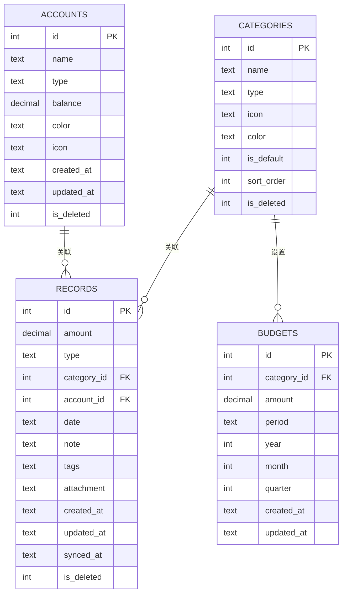

### 3.3 概念数据模型

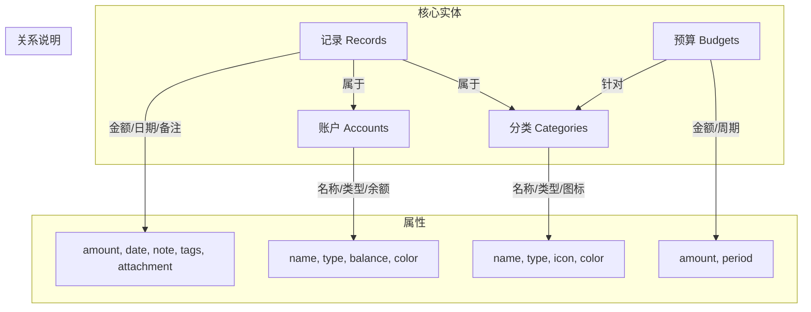

---

## 4. 用例图

### 4.1 系统用例图

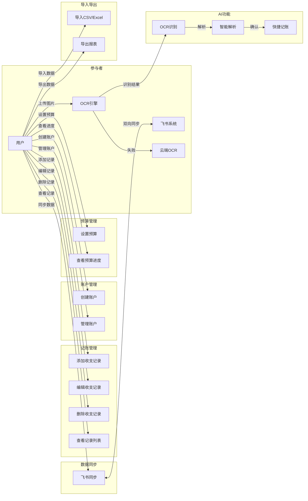

### 4.2 用例描述

#### 核心用例列表

| 用例编号 | 用例名称           | 参与者   | 描述                           |
|---------|-------------------|---------|-------------------------------|
| UC-001  | 添加收支记录        | 用户    | 用户手动添加一条收支记录            |
| UC-002  | OCR快捷记账        | 用户, OCR引擎 | 通过图片识别自动创建记录         |
| UC-003  | 管理账户           | 用户    | 创建、编辑、删除账户              |
| UC-004  | 设置预算           | 用户    | 为分类设置月度/季度/年度预算       |
| UC-005  | 查看统计图表        | 用户    | 查看收支趋势、分类占比等统计信息     |
| UC-006  | 飞书数据同步        | 用户, 飞书 | 与飞书多维表格双向同步数据         |
| UC-007  | 导入导出数据        | 用户    | 导入CSV/Excel，导出各种格式报告    |
| UC-008  | 预算超支提醒        | 系统    | 当消费超过预算时发送提醒           |

---

## 5. 核心模块设计

### 5.1 OCR 模块

#### 工作流程
1. 用户上传/粘贴截图
2. 优先尝试本地 PaddleOCR 识别
3. 本地失败时降级到云端 OCR
4. 解析识别结果，提取关键字段（金额、日期、商户、类别）
5. 展示识别结果给用户确认/编辑
6. 保存为记账记录

#### OCR 工作流程图

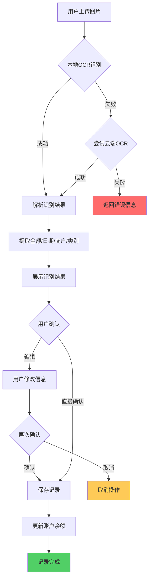

#### 关键接口
```typescript
interface OcrResult {
  amount?: number;
  date?: string;
  merchant?: string;
  category?: string;
  rawText: string;
}
```

### 5.2 飞书同步模块

#### 数据映射
- 本地 records 表 <-> 飞书多维表格「消费记录」
- 本地 accounts 表 <-> 飞书多维表格「账户」
- 本地 categories 表 <-> 飞书多维表格「分类」

#### 同步策略
- 增量同步：基于 updated_at/synced_at 字段
- 冲突解决：以最后更新时间为准
- 手动触发 + 自动定时同步

#### 同步流程图

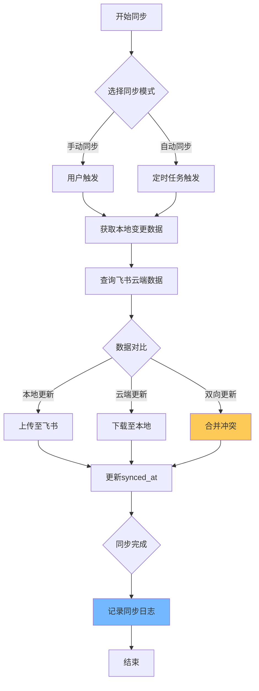

#### 同步冲突处理策略

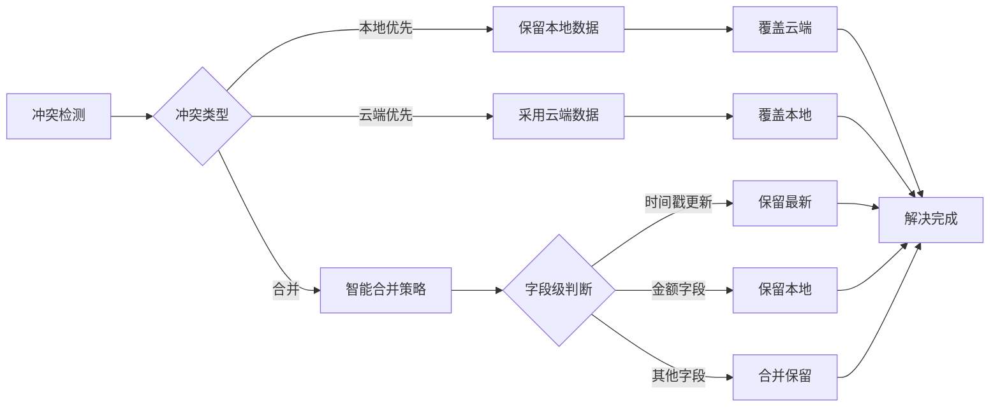

### 5.3 预算模块

#### 预算计算流程

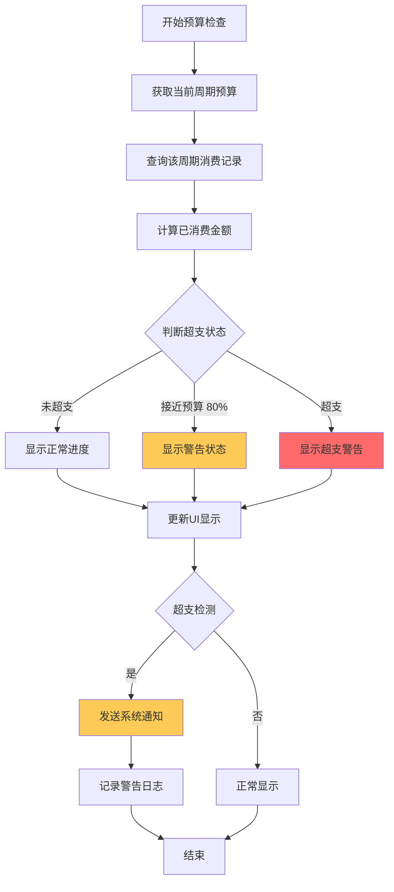

#### 预算计算公式

```
预算进度 = (已消费金额 / 预算金额) × 100%
剩余预算 = 预算金额 - 已消费金额
超支金额 = 已消费金额 - 预算金额 (当已消费 > 预算时)
```

### 5.4 数据导入导出流程

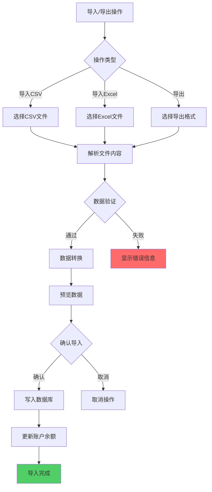

---

## 6. 关键业务流程

### 6.1 记账记录完整流程

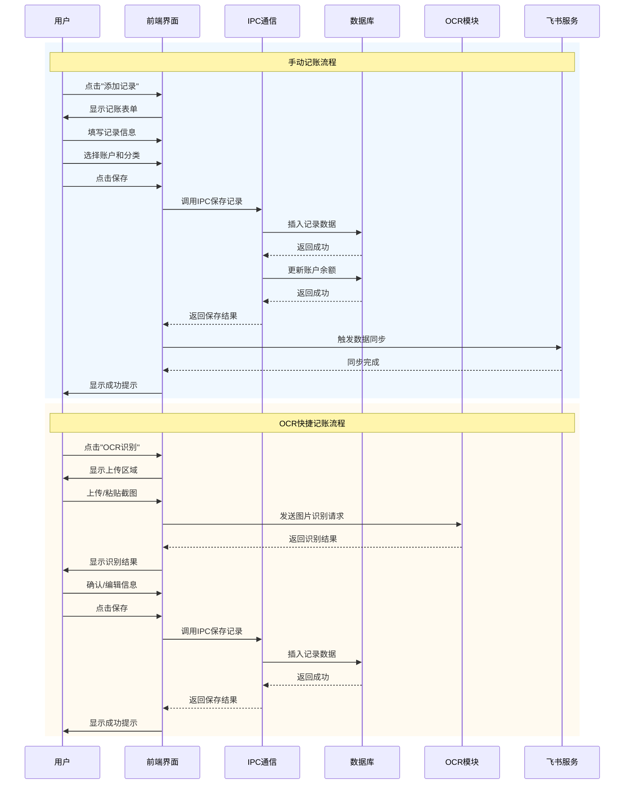

### 6.2 飞书同步完整流程

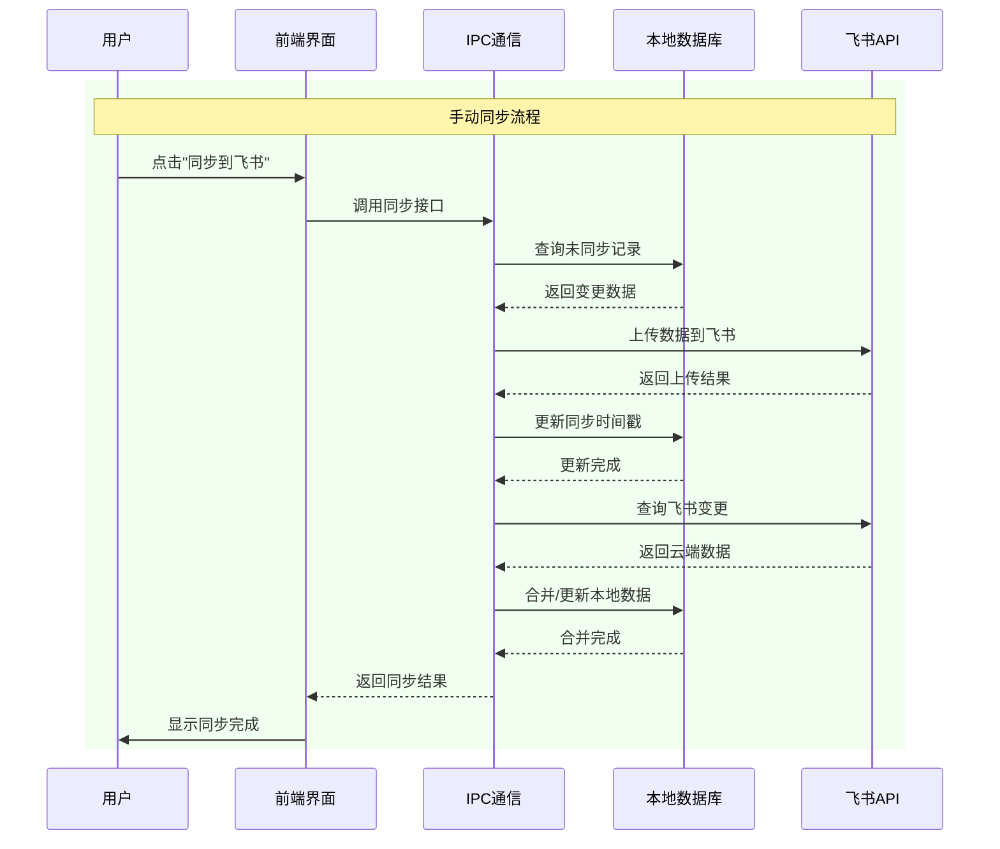

---

## 7. UI 设计要点

### 7.1 页面布局
- 左侧导航栏：Dashboard、记录、账户、预算、统计、设置
- 主内容区：展示各功能页面
- 快捷记账按钮（右下角悬浮）

### 7.2 核心页面
- **Dashboard**：今日收支概览、本月趋势、快捷操作
- **记录页**：记录列表（可筛选/搜索）、添加记录按钮
- **统计页**：多维度图表展示

### 7.3 UI 导航结构

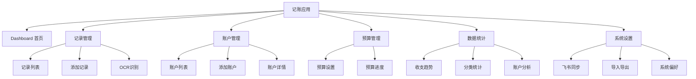

---

## 8. 安全性设计

### 8.1 数据安全流程

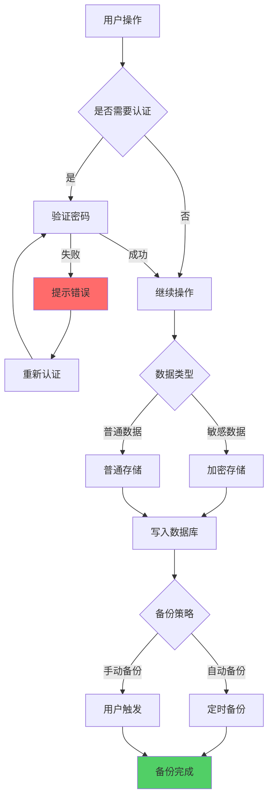

---

## 9. 性能优化设计

### 9.1 数据加载策略

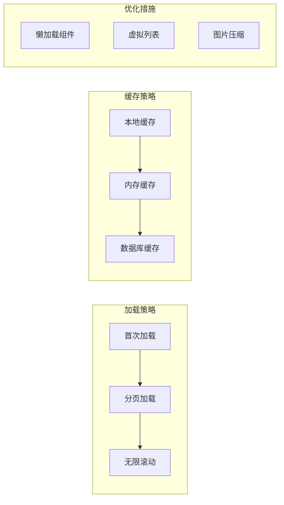

---

以上图表使用 Mermaid 语法编写，可以在支持 Mermaid 的 Markdown 编辑器中直接渲染查看。

如果需要使用其他图表格式（如 draw.io、PlantUML 等），请告诉我，我可以提供相应的文件格式。
